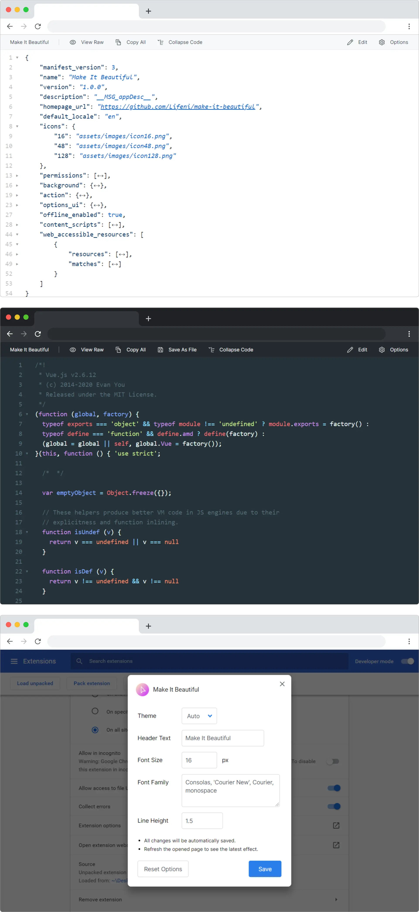

<p align="center">
  
</p>

<h1 align="center">Make It Beautiful</h1>
<p align="center">Make text pages beautiful and easy to read</p>
<p align="center">English | <a href="README.zh-CN.md">中文</a></p>

- [Introduction](#introduction)
- [Get Extension](#get-extension)
- [FAQ](#faq)
- [Screenshot](#screenshot)
- [Development](#development)
- [License](#license)

## Introduction

This is a browser extension that makes text pages look good and easy to read.

- 💻 **Simple User Interface**

  Reasonable color scheme and icons, supporting both light and dark themes.

- 📦 **Support Multiple Formats**

  Support JSON, Markdown and other common file formats.

- 💾 **Useful Features**

  Support code highlighting, code block folding, full text copying, file downloading (some websites need to save as manually due to security policy), temporary editing and other features.

- 🎨 **Customizable Options**

  Customizable fonts, themes and title bar text.

After installing the extension you can open [https://api.github.com/users/Lifeni/repos](https://api.github.com/users/Lifeni/repos) and try it out.

## Get Extension

You can get the extension at [Microsoft Edge Addon](https://microsoftedge.microsoft.com/addons/detail/make-it-beautiful/jjgkadobhgomjcppaojffnlooknkkodd).

For Chrome and Opera, you can download the zip archive in [Release](https://github.com/Lifeni/make-it-beautiful/releases) and install it manually.

## FAQ

See [FAQ · Lifeni/make-it-beautiful Wiki](https://github.com/Lifeni/make-it-beautiful/wiki/FAQ).

## Screenshot



## Development

Dependencies need to be installed before development. Yarn is recommended.

```shell
cd make-it-beautiful
yarn
```

This project contains both manifest v3 and v2 versions, both of which have the same functionality.

You can switch between the two versions during development based on the environment variable `MANIFEST`.

```shell
webpack --progress --env MANIFEST=v3
# webpack --progress --env MANIFEST=v2
```

Use `npm run dev` to run the v3 development build, and Chrome Canary is recommended for debugging.

## License

MIT License
