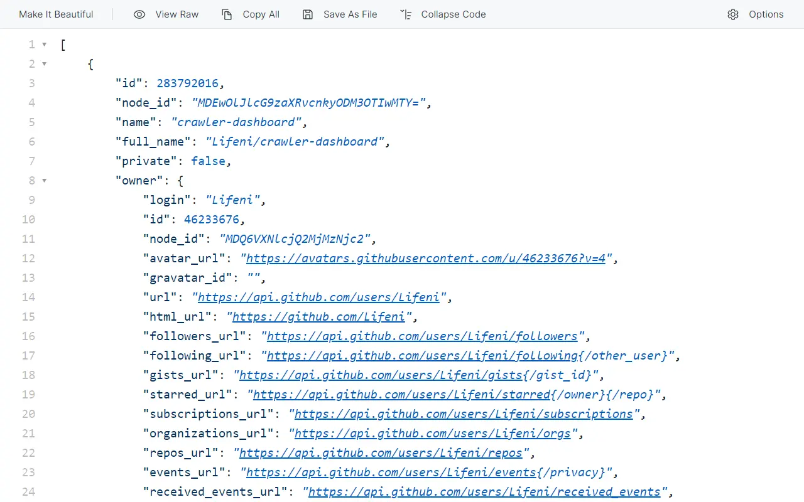
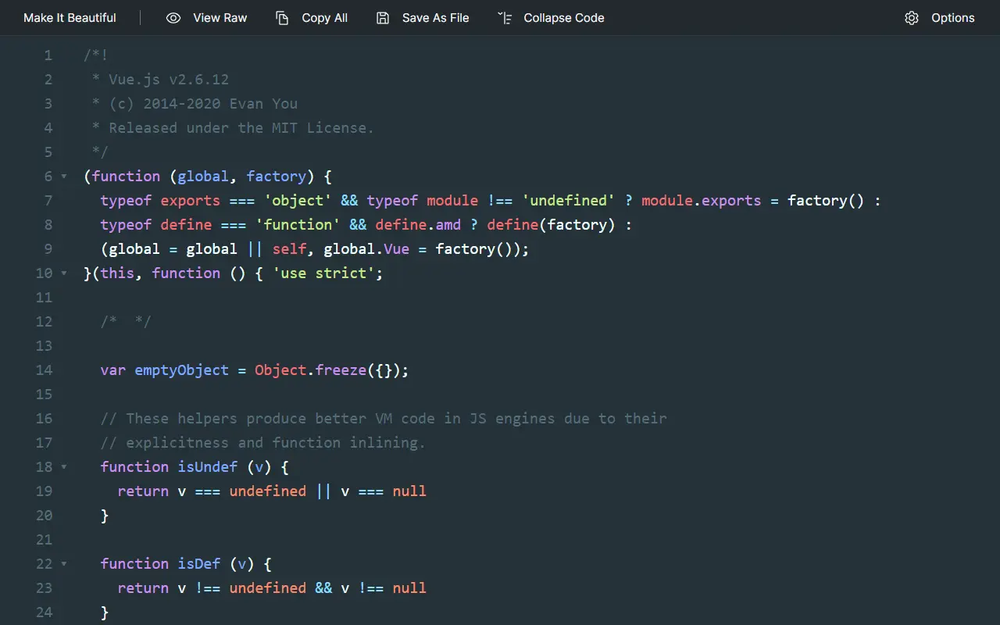
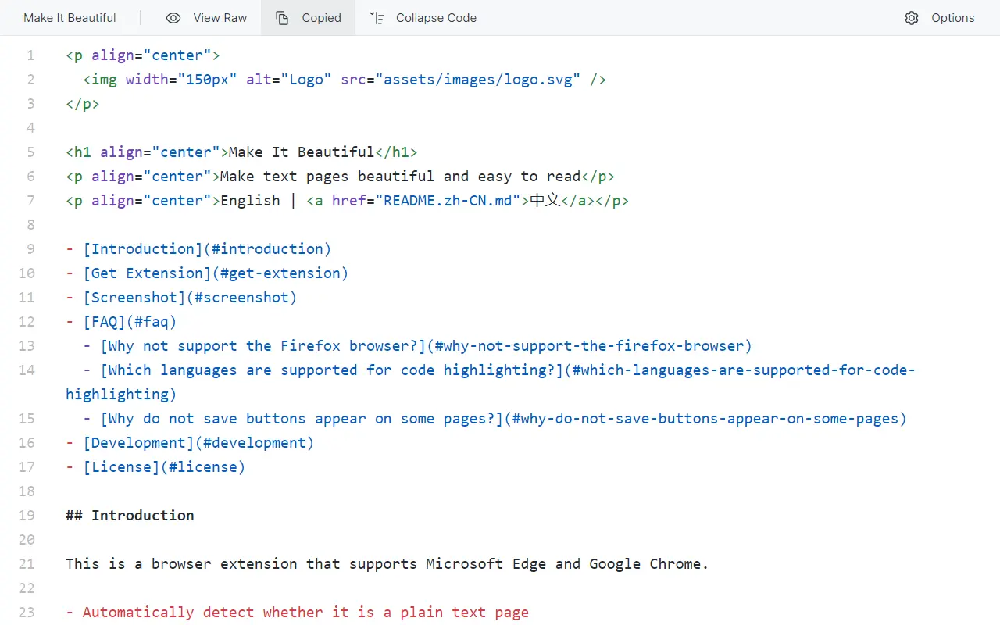
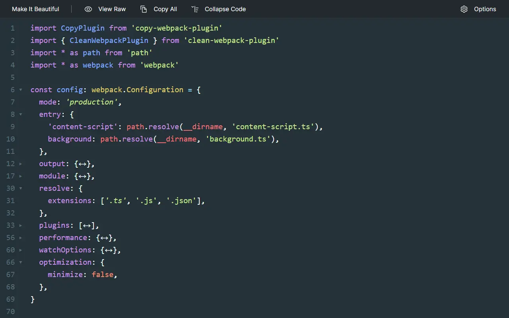
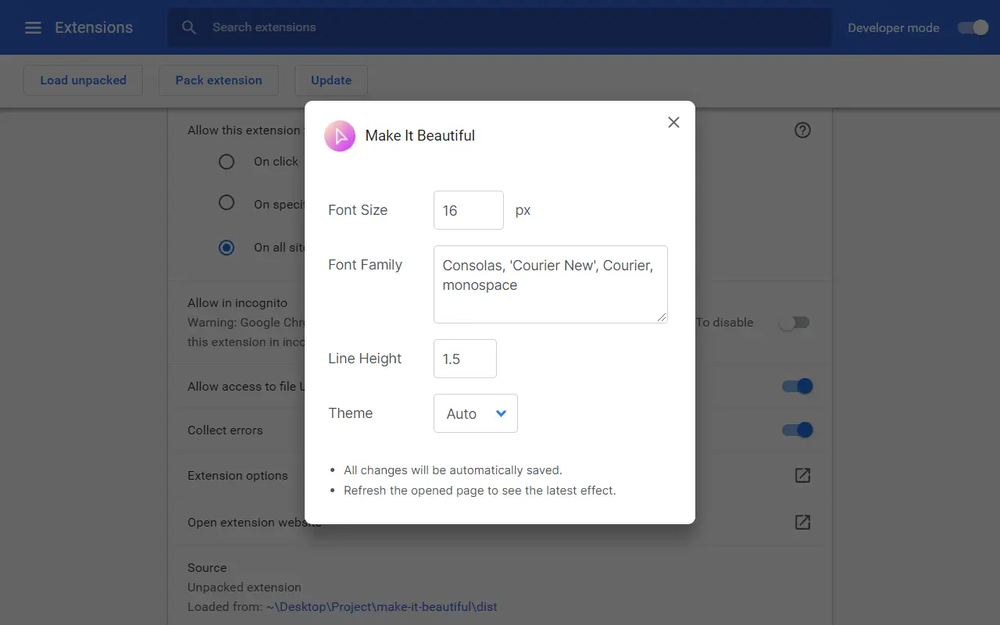

<p align="center">
  
</p>

<h1 align="center">Make It Beautiful</h1>
<p align="center">Make text pages beautiful and easy to read</p>
<p align="center">English | <a href="README.zh-CN.md">中文</a></p>

- [Introduction](#introduction)
- [Get Extension](#get-extension)
- [Screenshot](#screenshot)
- [FAQ](#faq)
  - [Why not support the Firefox browser?](#why-not-support-the-firefox-browser)
  - [Which languages are supported for code highlighting?](#which-languages-are-supported-for-code-highlighting)
  - [Why do not save buttons appear on some pages?](#why-do-not-save-buttons-appear-on-some-pages)
- [Development](#development)
- [License](#license)

## Introduction

This is a browser extension and currently only supports Microsoft Edge.

- 📦 **Support multiple formats**

    It supports JSON, Markdown and other formats, and automatically guesses the file format based on the URL suffix.

- 💻 **Simple interface**

    Supports automatic switching between light and dark mode, no extra elements.

- 💾 **Useful features**

    Code highlighting, code block folding, full text copy, file download (some websites need to be saved as manually due to security policies).

- 🎨 **Customization Options**

    You can customize fonts and themes.

After installing the extension, you can open [https://api.github.com/users/Lifeni/repos](https://api.github.com/users/Lifeni/repos) to have a try, this link will return a JSON file.

The extension also supports files in many other formats, such as [README.md](https://raw.githubusercontent.com/Lifeni/make-it-beautiful/master/README.md) and [webpack.config.ts](https://raw.githubusercontent.com/Lifeni/make-it-beautiful/master/webpack.config.ts).

## Get Extension

You can get the extension at [Microsoft Edge Addon](https://microsoftedge.microsoft.com/addons/detail/make-it-beautiful/jjgkadobhgomjcppaojffnlooknkkodd).

For Chrome and Opera, crx packages may be provided for manual installation in the future.

## Screenshot

<details>
   <summary>Code highlighting</summary>



</details>

<details>
   <summary>Dark mode</summary>



</details>

<details>
   <summary>Copy full text</summary>



</details>

<details>
   <summary>Code block folding</summary>



</details>

<details>
   <summary>Options page</summary>



</details>

## FAQ

### Why not support the Firefox browser?

Because the core function provided by this extension is included in the Firefox.

### Which languages are supported for code highlighting?

See: [components/queryFileType.ts](components/queryFileType.ts).

### Why do not save buttons appear on some pages?

Due to the influence of Content Security Policy (CSP), some websites cannot trigger the save dialog box and need to be saved manually (<kbd>Ctrl</kbd> + <kbd>S</kbd> or right-click menu to save).

For websites where the save button does not appear, see: [components/queryCSPDomainList.ts](components/queryCSPDomainList.ts).

## Development

This project contains two versions of manifest v3 and v2 at the same time. The functions of the two versions are the same. During development, you can package v3 and v2 respectively according to `webpack.config.ts` and `webpack.config.v2.ts`.

Dependencies need to be installed before development. Yarn is recommended.

```shell
yarn
```

Use `npm run dev` to run the v3 version of the development and build. It is recommended to use Chrome Canary for debugging.

## License

MIT License
