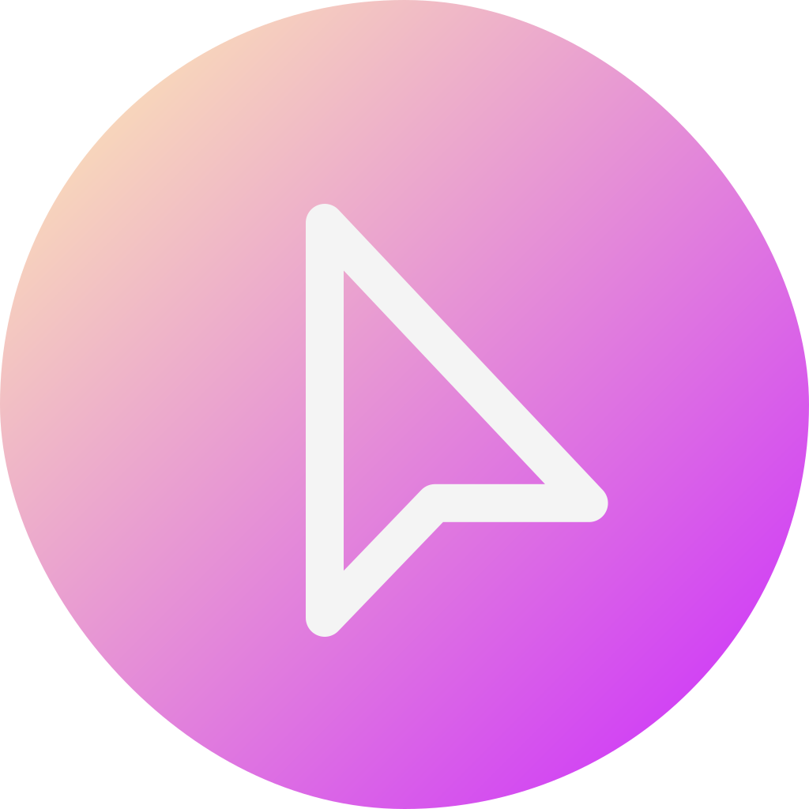

<p align="center">
  
</p>

<h1 align="center">Make It Beautiful</h1>
<p align="center">Make text pages beautiful and easy to read</p>
<p align="center">English | <a href="README.zh-CN.md">中文</a></p>

- [Get Extension](#get-extension)
- [Introduction](#introduction)
- [Extension Screenshot](#extension-screenshot)
- [FAQ](#faq)
- [Development](#development)
- [License](#license)

## Get Extension

You can get the extension at [Microsoft Edge Addon](https://microsoftedge.microsoft.com/addons/detail/make-it-beautiful/jjgkadobhgomjcppaojffnlooknkkodd).

For Chrome and Opera, you can download the zip archive in [Release](https://github.com/Lifeni/make-it-beautiful/releases) and install it manually.

## Introduction

This is a browser extension that currently only supports Microsoft Edge.

- 💻 **Simple interface**

  Supports automatic switching between light and dark modes.

- 📦 **Support for multiple formats**

  Support code highlighting, code block folding, full text copying, file downloading (some websites need to save as manually due to security policy), temporary editing and other functions.

- 💾 **Useful features**

  Code highlighting, code block folding, full text copying, file downloading (some sites need to save as manually due to security policies).

- 🎨 **Customization options**

  Customizable fonts, themes and title bar text.

After installing the extension you can open [https://api.github.com/users/Lifeni/repos](https://api.github.com/users/Lifeni/repos) and try it out.

The extension also supports many other formats, such as [README.md](https://raw.githubusercontent.com/Lifeni/make-it-beautiful/master/README.md) and [webpack.config.ts]( https://raw.githubusercontent.com/Lifeni/make-it-beautiful/master/webpack.config.ts).

## Extension Screenshot


## FAQ

See [FAQ · Lifeni/make-it-beautiful Wiki](https://github.com/Lifeni/make-it-beautiful/wiki/FAQ).

## Development

This project contains two versions of manifest v3 and v2 at the same time. The functions of the two versions are the same. During development, you can switch between different builds based on the 'MANIFEST' environment variable, see [package.json](./package.json).

Dependencies need to be installed before development. Yarn is recommended.

```shell
cd make-it-beautiful
yarn
```

Use `npm run dev` to run the v3 version of the development and build. It is recommended to use Chrome Canary for debugging.

## License

MIT License
