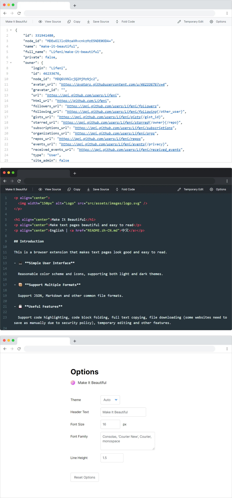

<p align="center">
  
</p>

<h1 align="center">Make It Beautiful</h1>
<p align="center">把文本页面变得好看和易于阅读</p>
<p align="center"><a href="README.md">English</a> | 中文</p>

- [介绍](#介绍)
- [获取](#获取)
- [截图](#截图)
- [常见问题](#常见问题)
- [开发](#开发)
- [开源协议](#开源协议)

## 介绍

这是一个可以把文本页面变得好看和易于阅读的浏览器扩展。

- 💻 **简洁的界面**

  支持自动切换亮色和暗色模式，没有多余的元素。

- 📦 **支持多种格式**

  支持 JSON、Markdown 等格式，自动根据 URL 后缀推测文件格式。

- 💾 **实用的功能**

  支持代码高亮、代码块折叠、全文复制、文件下载（部分网站由于安全策略，需要手动另存为）、临时编辑等功能。

- 🎨 **自定义选项**

  可以自定义字体、主题和标题栏文本。

安装插件以后可以打开 [https://api.github.com/users/Lifeni/repos](https://api.github.com/users/Lifeni/repos) 试一试。

## 获取

可以在 [Microsoft Edge 外接程序](https://microsoftedge.microsoft.com/addons/detail/make-it-beautiful/jjgkadobhgomjcppaojffnlooknkkodd) 上获取插件。

对于 Chrome 以及 Opera，可以下载 [Release](https://github.com/Lifeni/make-it-beautiful/releases) 中的 zip 压缩包进行手动安装。

## 截图



## 常见问题

请查看 [常见问题 · Lifeni/make-it-beautiful Wiki](https://github.com/Lifeni/make-it-beautiful/wiki/%E5%B8%B8%E8%A7%81%E9%97%AE%E9%A2%98) 。

## 开发

进行开发前需要先安装依赖，推荐使用 Yarn 安装。

```shell
cd make-it-beautiful
yarn
```

本项目同时包含 manifest v3 与 v2 两个版本，两个版本的功能相同。开发时你可以根据环境变量 `MANIFEST` 来切换不同版本的编译。

```shell
webpack --progress --env MANIFEST=v3
# webpack --progress --env MANIFEST=v2
```

使用 `npm run dev` 运行 v3 版本的开发构建，建议使用 Chrome Canary 进行调试。

## 开源协议

MIT License
